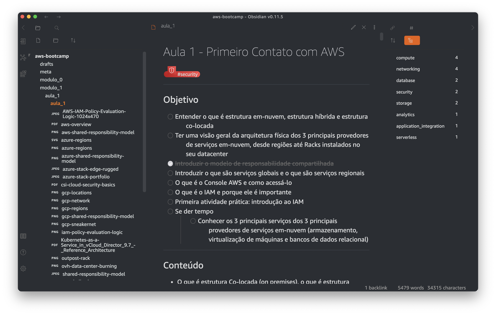
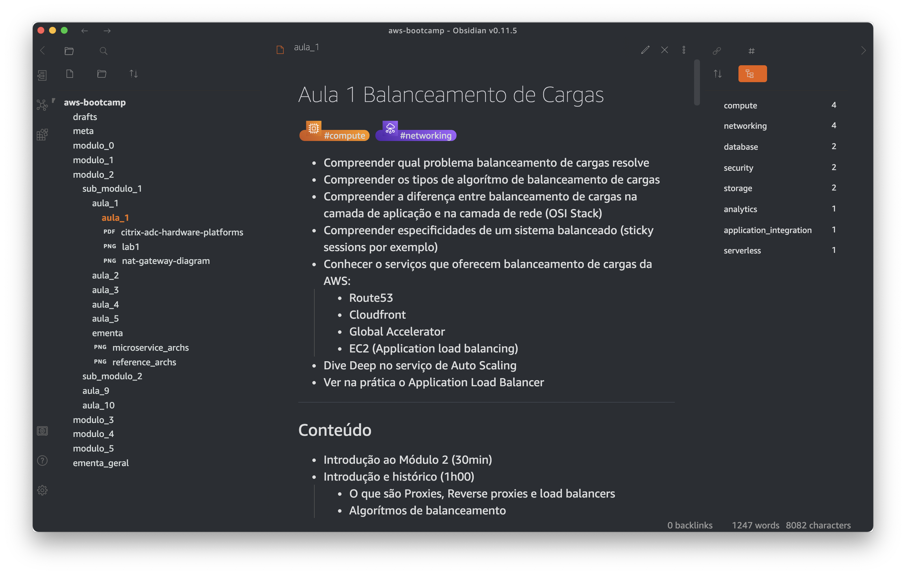
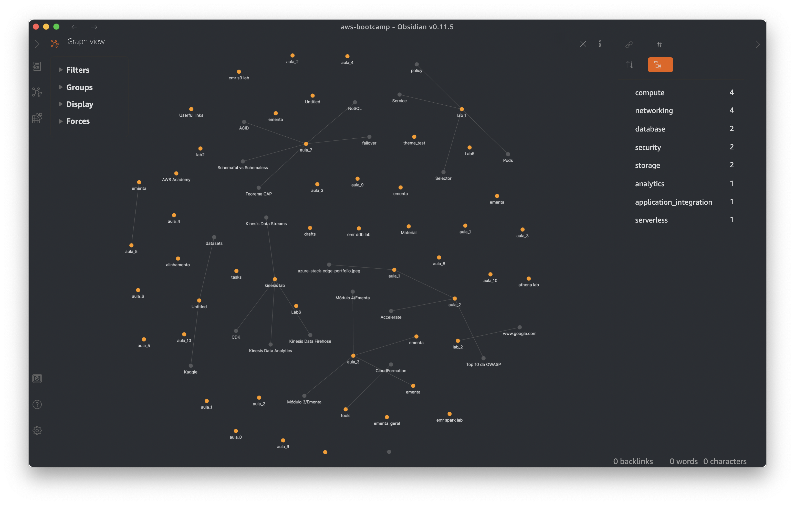
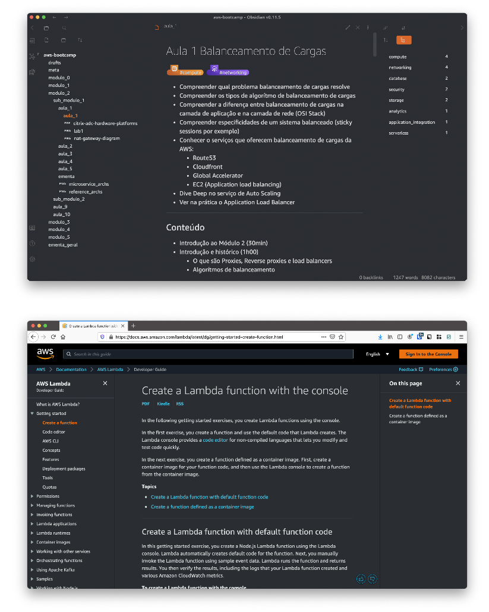

# AWS Theme for Obsidian

This is an Obsidian theme inspired on AWS Polaris UI design.

The css was based on @DubininDmitry's [Obuntu-theme-for-Obsidian](https://github.com/DubininDmitry/Obuntu-theme-for-Obsidian).

## Some screenshots

And this is a comparison of the AWS docs page and this theme.

